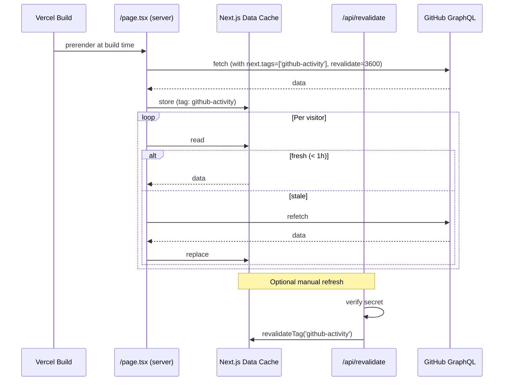
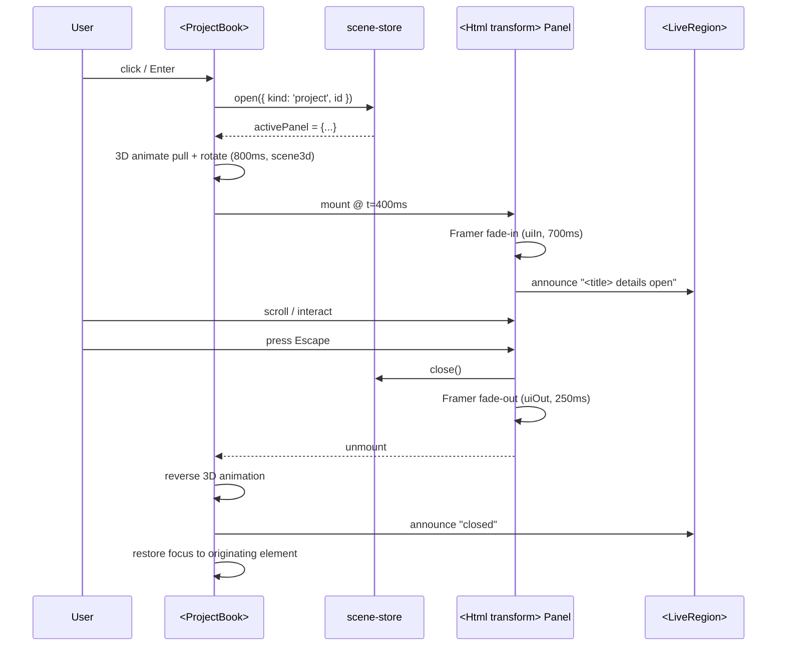
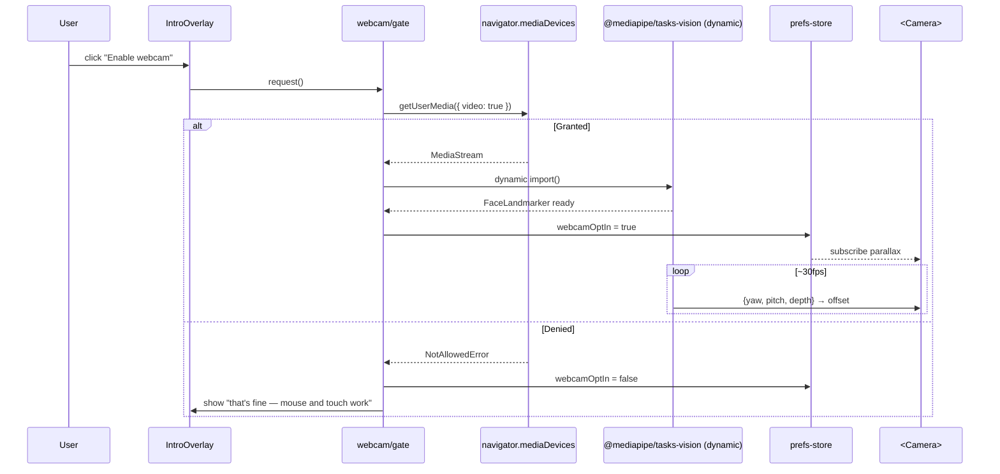

# Atelier — Architecture

> Source of truth for all design decisions. Read `docs/BRIEF.md` first for
> product concept; this document encodes how it gets built.

## 1. Executive Summary

**Atelier** is a first-person, seated-at-a-desk 3D portfolio website. The
viewer sits at the developer's desk and sees the scene through their
eyes. The centerpiece is an open book on the desk showing live GitHub
activity pulled from the GitHub GraphQL API. Surrounding desk objects
expose the rest of the portfolio — projects, skills, experience,
location.

The window's ambient lighting shifts with the viewer's local system
time, producing four distinct visual states (morning, day, evening,
night) as an additional layer of immersion. State is set on load and
remains fixed for the session.

**Who it is for.** Hiring managers, engineering leads, potential
collaborators, and other engineers evaluating the developer for
front-end / creative / full-stack work. They arrive from a link (resume,
LinkedIn, a shared tweet), spend 60–180 seconds, and leave with either
an interview request or a memory sharp enough to recall later.

**Why it exists.** To demonstrate simultaneous craft in creative WebGL,
production-quality 2D UI, and real data integration through a single
highly-composed scene — rather than a sprawling content site. The scope
is deliberately bounded to be finishable solo and honest about the
developer's actual public work history.

**What it is not.** Not a free-movement 3D experience, not a procedural
environment, not a résumé dump, not a metaphor that requires
explanation. Every choice in this document defers to those boundaries.

---

## 2. Project Directory Structure

Single Next.js application. No workspaces — the project is deliberately
one deployable artifact. Domain-driven naming throughout; no `utils/`,
`helpers/`, or `common/` directories.

```
atelier/
├── README.md
├── LICENSE
├── package.json
├── pnpm-lock.yaml
├── tsconfig.json
├── next.config.mjs
├── tailwind.config.ts
├── postcss.config.mjs
├── vitest.config.ts
├── playwright.config.ts
├── components.json                    # shadcn/ui config
├── eslint.config.mjs
├── .prettierrc
├── .env.example
├── .env.local                         # gitignored
├── .gitignore
├── .nvmrc                             # 20.x
├── instrumentation.ts                 # Next.js Sentry init hook
├── sentry.client.config.ts
├── sentry.server.config.ts
├── sentry.edge.config.ts
│
├── docs/
│   ├── BRIEF.md
│   ├── architecture.md                # this document
│   ├── architecture-review.md
│   ├── deliverables-checklist.md
│   ├── phase-N-tasks.md               # generated per phase
│   └── phase-N-review.md              # generated per phase
│
├── public/
│   ├── favicon.svg
│   ├── fonts/
│   │   ├── inter-variable.woff2
│   │   └── jetbrains-mono-variable.woff2
│   └── scene/
│       ├── models/
│       │   └── desk.glb               # Draco-compressed geometry
│       ├── textures/                  # KTX2/Basis; WebP fallback
│       │   ├── desk-albedo.ktx2
│       │   ├── desk-normal.ktx2
│       │   ├── desk-roughness.ktx2
│       │   └── ...
│       └── lightmaps/                 # one per time-of-day state
│           ├── morning.ktx2
│           ├── day.ktx2
│           ├── evening.ktx2
│           └── night.ktx2
│
├── src/
│   ├── app/
│   │   ├── layout.tsx
│   │   ├── page.tsx                   # the scene page
│   │   ├── globals.css
│   │   ├── opengraph-image.tsx        # pre-rendered evening hero
│   │   ├── fallback/
│   │   │   └── page.tsx               # no-JS semantic portfolio
│   │   └── api/
│   │       ├── health/
│   │       │   └── route.ts           # GitHub connectivity smoke test
│   │       └── revalidate/
│   │           └── route.ts           # authenticated ISR webhook
│   │
│   ├── scene/
│   │   ├── Scene.tsx                  # root R3F Canvas + composition
│   │   ├── Camera.tsx                 # fixed camera + optional parallax
│   │   ├── Desk.tsx
│   │   ├── Window.tsx
│   │   ├── Lamp.tsx
│   │   ├── live-activity/
│   │   │   ├── LiveActivityBook.tsx
│   │   │   ├── ContributionGrid.tsx   # left page, 3D-extruded
│   │   │   ├── EventsFeed.tsx         # right page via drei <Html>
│   │   │   └── materials.ts
│   │   ├── project-books/
│   │   │   ├── ProjectBookStack.tsx
│   │   │   ├── ProjectBook.tsx
│   │   │   └── spine-design.ts        # per-project spine factory
│   │   ├── ambient/
│   │   │   ├── DustMotes.tsx
│   │   │   ├── PageFlutter.tsx
│   │   │   └── LampBreathe.tsx
│   │   ├── post-processing/
│   │   │   └── Effects.tsx            # bloom, CA, grain, tonemap per state
│   │   └── lighting/
│   │       ├── Lightmaps.tsx          # loads only the active state's map
│   │       ├── RealTimeLights.tsx     # lamp key light, hover highlights
│   │       └── bake-presets.ts        # per-state intensity/color tables
│   │
│   ├── content/
│   │   ├── profile.ts                 # name, role, city, github username
│   │   ├── projects/
│   │   │   ├── index.ts               # ordered array
│   │   │   ├── schemas.ts             # Zod Project schema
│   │   │   └── *.ts                   # one module per project
│   │   ├── skills/
│   │   │   ├── index.ts
│   │   │   └── schemas.ts
│   │   └── experience/
│   │       ├── index.ts
│   │       └── schemas.ts
│   │
│   ├── data/
│   │   ├── github/
│   │   │   ├── client.ts              # server-only GraphQL fetcher
│   │   │   ├── queries.ts             # contributionsCollection, events
│   │   │   ├── types.ts               # GraphQL response types
│   │   │   ├── transform.ts           # GraphQL → domain types
│   │   │   └── cache.ts               # ISR revalidate tags + ttl
│   │   └── loaders/
│   │       └── projects.ts            # typed loader over content/
│   │
│   ├── time-of-day/
│   │   ├── resolve.ts                 # hour/URL → TimeOfDayState
│   │   ├── presets.ts                 # lightmap + post-fx per state
│   │   └── types.ts
│   │
│   ├── interaction/
│   │   ├── keyboard.ts                # tab order + Esc routing
│   │   ├── pointer.ts                 # hover + click dispatcher
│   │   └── webcam/
│   │       ├── FaceTracker.tsx        # lazy MediaPipe wrapper
│   │       ├── parallax.ts            # head pose → camera offset
│   │       └── gate.tsx               # opt-in prompt + consent storage
│   │
│   ├── ui/
│   │   ├── panels/
│   │   │   ├── PanelFrame.tsx
│   │   │   ├── ProjectPanel.tsx
│   │   │   ├── SealedProjectPanel.tsx # NDA variant
│   │   │   └── EventsFeedPanel.tsx
│   │   ├── intro/
│   │   │   ├── IntroOverlay.tsx
│   │   │   └── StartupSequence.tsx
│   │   ├── controls/
│   │   │   ├── WebcamToggle.tsx
│   │   │   └── AccentProvider.tsx     # CSS variable plumbing
│   │   ├── a11y/
│   │   │   ├── SkipToFallback.tsx
│   │   │   └── LiveRegion.tsx
│   │   ├── primitives/                # shadcn-generated components
│   │   │   ├── button.tsx
│   │   │   ├── dialog.tsx
│   │   │   └── ...
│   │   └── motion/
│   │       └── tokens.ts              # eased curves, durations
│   │
│   ├── store/
│   │   ├── scene-store.ts             # Zustand: activePanel, hoveredObject
│   │   ├── prefs-store.ts             # Zustand: reducedMotion, webcamOptIn
│   │   └── time-of-day-store.ts       # Zustand: resolved state (read-only after init)
│   │
│   ├── telemetry/
│   │   ├── events.ts                  # typed custom event names
│   │   └── web-vitals.ts              # Next.js web-vitals reporter
│   │
│   ├── styles/
│   │   └── tokens.css                 # accent color + type tokens
│   │
│   └── lib/
│       ├── env.ts                     # zod-validated env access
│       └── logger.ts                  # pino-based server logger
│
├── scripts/
│   ├── asset-pipeline/
│   │   ├── compress-geometry.mjs      # Draco via @gltf-transform
│   │   ├── compress-textures.mjs      # KTX2/Basis via @gltf-transform
│   │   └── verify-budgets.mjs         # fails CI if scene assets > 15MB
│   └── bake-lightmaps.md              # Blender workflow reference
│
├── tests/
│   ├── unit/
│   │   ├── time-of-day.test.ts
│   │   ├── github-transform.test.ts
│   │   ├── content-schemas.test.ts
│   │   └── env.test.ts
│   ├── component/
│   │   ├── ProjectPanel.test.tsx
│   │   ├── IntroOverlay.test.tsx
│   │   └── SealedProjectPanel.test.tsx
│   └── e2e/
│       ├── fixtures/
│       │   └── github-mock.ts
│       ├── scene-load.spec.ts
│       ├── project-book-open.spec.ts
│       ├── time-of-day-override.spec.ts
│       ├── keyboard-nav.spec.ts
│       ├── reduced-motion.spec.ts
│       ├── fallback.spec.ts
│       └── visual/
│           └── hero-states.spec.ts    # screenshot-per-state regression
│
└── .github/
    └── workflows/
        ├── ci.yml                     # type-check, lint, unit, e2e, budgets
        └── visual-regression.yml      # screenshot diff on preview deploys
```

---

## 3. Architecture Decision Records

### ADR-001: Next.js App Router on Vercel

- **Status:** Accepted
- **Context:** Server-side GitHub PAT handling and ISR require a server
  capable of running Next.js's full feature set. The site also benefits
  from edge caching and preview deployments.
- **Decision:** Next.js `15.x` with the App Router, deployed on
  **Vercel** (hobby/pro tier). Node `20.x` runtime.
- **Rationale:** Native Next.js host — ISR, env vars, edge network, and
  OG image generation work out of the box with zero config. Self-hosting
  would add ops work unrelated to the product. Static export would lose
  ISR and force rebuild-to-refresh-data.
- **Consequences:**
  - Couples deployment story to Vercel. Mitigation: the app stays vanilla
    Next.js, so a future migration to Node/Docker is mechanical.
  - ISR revalidation is cache-tag based; cache-tag discipline must be
    enforced in `data/github/cache.ts`.
- **Product justification:** The live-activity book is the hero of the
  site; ISR is what makes "live" not "last deploy." Vercel makes that
  work with the least risk of shipping staleness to visitors.

### ADR-002: React Three Fiber + drei as the 3D runtime

- **Status:** Accepted
- **Context:** The scene is React-rendered. The UI layer and the 3D
  layer need to share state and — critically — share screen space for
  the diegetic book-opens-to-UI pattern.
- **Decision:** `three@0.170.x`, `@react-three/fiber@8.17.x`,
  `@react-three/drei@9.x`, `@react-three/postprocessing@2.16.x`.
- **Rationale:** Colocating the scene with React components removes the
  "two worlds, awkward bridge" problem that vanilla Three.js creates in
  a component-driven UI codebase. drei's `<Html transform>` is the
  simplest path to the diegetic UI pattern (Section 5.5).
- **Consequences:**
  - React reconciliation overhead per frame is non-zero; component
    granularity must be chosen carefully in hot paths (no per-dust-mote
    components).
  - Upgrading R3F across major versions historically requires care —
    lock versions, test visually before bumping.
- **Product justification:** Without React interop, every interactive
  object would need bespoke glue code. The interaction vocabulary — 6
  total interactions — is too small to justify that cost.

### ADR-003: Diegetic UI via drei `<Html transform>`

- **Status:** Accepted
- **Context:** The book-opens-to-UI pattern is the most frequent
  interaction. Panels must appear composited onto book pages, feel like
  the real shipped product UI (shadcn-quality typography, real
  components), and remain accessible.
- **Decision:** Render panels as real DOM via drei's `<Html transform>`,
  positioned in 3D space but composed by the browser's DOM layer. MSDF
  3D text (troika-three-text via drei `<Text>`) is reserved for
  in-scene type that must obey depth-of-field and lighting (book spines,
  globe labels).
- **Rationale:** Real DOM preserves keyboard navigation, screen reader
  semantics, real typography, Framer Motion transitions, and shadcn
  component reuse. Render-to-texture would require reimplementing those
  stacks inside WebGL.
- **Consequences:**
  - `<Html>` panels are composited above WebGL — they do not
    depth-sort against other 3D objects naturally. Evaluated per-surface;
    the book page is the only diegetic surface in V1, so this is
    tractable.
  - Post-processing (bloom, CA) does not apply to DOM panels. This is
    the correct behavior for sharp UI and is an explicit aesthetic
    choice.
- **Product justification:** Panel readability is the product. A panel
  that looks like a real product panel is worth more than a rendered
  texture that looks vaguely like one.

### ADR-004: GitHub GraphQL v4 with server-only PAT + ISR

- **Status:** Accepted
- **Context:** GitHub data must be fresh, authenticated, and never
  expose the PAT. The browser must not make GitHub calls.
- **Decision:** Single server-side fetcher in `src/data/github/client.ts`
  using GitHub GraphQL v4. Queries run at build time for initial payload
  and every 1 hour via Next.js ISR (`revalidate: 3600`) with cache tag
  `github-activity`. Manual invalidation via `POST /api/revalidate` with
  a shared secret for post-deploy refreshes.
- **Rationale:** ISR unifies build-time and runtime freshness under one
  code path. Cache tags let us invalidate on demand without redeploying.
  GraphQL lets us fetch the shape we need (contributions + PRs + events)
  in one round trip.
- **Consequences:**
  - A warm cache hit is essentially free; a cold/stale miss takes the
    full GitHub round-trip. p50 visitor experiences the cache; p99 may
    wait ~300–800ms. The event feed must render placeholders to avoid
    layout shift on the first uncached request.
  - PAT scopes: `read:user`, `repo` (only if private repo activity is
    desired); the decision of which to grant is a deployment
    configuration concern, not an architecture one.
- **Product justification:** "Live" is a claim the visitor must trust.
  The data path must be honest — server-side only, real freshness —
  because the whole hero object is built on it.

### ADR-005: Time-of-day state resolved at page load, lightmap-swapped

- **Status:** Accepted
- **Context:** Four distinct visual states (morning/day/evening/night)
  must each look production-grade. Live transitions would quadruple
  iteration cost on composition/materials and dilute the per-state
  craft.
- **Decision:** State is resolved once per session from
  `new Date().getHours()` (client-side) or a `?time=X` URL override.
  Each state owns a lightmap set + post-processing preset + lamp
  intensity value. Only the active state's lightmap is fetched over the
  network.
- **Rationale:** Matches brief's explicit non-goal of live transitions.
  Keeps per-session asset budget tight (single lightmap set). Makes the
  four states independently perfectible.
- **Consequences:**
  - Four lightmap baking passes per scene composition change. Mitigation:
    lock composition/materials before the full bake; iterate
    development on evening only.
  - Visitors crossing midnight never see the state change. This is the
    intended product behavior.
- **Product justification:** Each state is a complete composition —
  not a frame in a day-night cycle. Baking per state is how each frame
  becomes a keeper.

### ADR-006: Content authored as typed TypeScript modules + Zod schemas

- **Status:** Accepted
- **Context:** Projects, skills, and experience content must be
  authorable without a CMS, type-safe, refactorable, and validatable.
- **Decision:** One TypeScript module per project under
  `src/content/projects/*.ts`; Zod schemas in
  `src/content/*/schemas.ts` enforce shape at import time. Experience
  and skills follow the same pattern. A single runtime-validation pass
  at boot (in `src/data/loaders/projects.ts`) fails loudly on mismatch.
- **Rationale:** The site has one author (the developer). A CMS is
  overhead. MDX is useful only if project write-ups embed components;
  the panel design (Section 5.4) uses structured fields (role, problem,
  stack, etc.) that are cleaner as typed data. Zod at the boundary
  catches bad authoring before ship.
- **Consequences:**
  - Adding a project requires editing code + opening a PR. For a
    personal portfolio, this is a feature, not a bug.
  - Long-form prose is less ergonomic than MDX; the panel schema
    accommodates a `longDescription` markdown string if needed.
- **Product justification:** Type-safe authoring prevents the common
  portfolio failure mode of mis-styled or missing fields in a project
  card.

### ADR-007: shadcn/ui + Tailwind + Framer Motion for the 2D layer

- **Status:** Accepted
- **Context:** The 2D panels must feel like Linear/Vercel/Stripe-grade
  product UI — not a styled prototype.
- **Decision:** shadcn/ui (latest) as the component base,
  `tailwindcss@4.x`, `framer-motion@11.x`. Accent color exposed as a
  CSS variable (`--accent`) so the design can be retuned without code
  changes.
- **Rationale:** shadcn owns the components in-repo (no opaque package
  updates breaking things mid-project). Tailwind v4's engine and config
  ergonomics are a better fit for 2026-era Next.js than v3. Framer
  Motion is the industry-default for the UI motion language described
  in the brief (snappier, modern).
- **Consequences:**
  - shadcn components live in `src/ui/primitives/` and are edited
    directly — no upstream upgrade path.
  - Tailwind v4's CSS-first config needs discipline; token definitions
    live in `src/styles/tokens.css` rather than `tailwind.config.ts`.
- **Product justification:** The panel is where the recruiter actually
  reads about your work. It must not feel like a portfolio; it must
  feel like a product.

### ADR-008: Zustand for cross-cutting client state

- **Status:** Accepted
- **Context:** Several orthogonal concerns (time-of-day resolved state,
  active panel, hovered object, reduced-motion, webcam consent) must be
  read from both the 3D scene (inside R3F's render loop) and the 2D
  layer (inside React's reconciler).
- **Decision:** Three Zustand stores: `scene-store` (ephemeral
  interaction state), `prefs-store` (user preferences, persisted to
  `localStorage`), `time-of-day-store` (write-once, read-only after
  init).
- **Rationale:** React Context re-renders every consumer on every
  change — unacceptable in R3F's per-frame render loop. Zustand's
  selector-based subscriptions are frame-safe and compose naturally
  with the `useFrame` hook. Jotai is equivalent; Zustand is the R3F
  community default and the ecosystem advantage matters.
- **Consequences:**
  - Three store files must be kept semantically disjoint — a pref
    doesn't belong in `scene-store`, a panel state doesn't belong in
    `prefs-store`.
  - SSR hydration for `prefs-store` must be careful — `localStorage`
    read happens client-side only.
- **Product justification:** 60fps on an M1 Air across all states
  (Section 7.4 perf budget). Context-driven re-renders would put that
  target at risk.

### ADR-009: MediaPipe Face Landmarker, opt-in and lazy-loaded

- **Status:** Accepted
- **Context:** Head-tracked parallax is explicitly opt-in and pure
  enhancement. MediaPipe WASM + model weights are ~5–10MB; they must
  not land in the initial bundle.
- **Decision:** `@mediapipe/tasks-vision` loaded via dynamic `import()`
  only after the user clicks "Enable webcam" in `IntroOverlay` or the
  corner `WebcamToggle`. Disabled entirely on mobile user-agents.
- **Rationale:** Honors the brief's non-requirement: everything works
  without webcam. Meets the performance budget (<1MB initial JS). Keeps
  the default visitor experience free of permission prompts.
- **Consequences:**
  - First enable has a perceptible load cost (~500ms–1s). Loader UI
    must match the rest of the system's motion language.
  - MediaPipe model hosting: ship weights from the same origin or a
    trusted CDN — never call GCP's default hosted URLs in production
    (privacy + CORS reliability).
- **Product justification:** The default path is minimalism. Parallax
  is for visitors who lean in — it's a bonus, not a cost.

### ADR-010: Asset pipeline — Draco + KTX2/Basis via @gltf-transform

- **Status:** Accepted
- **Context:** Performance budget: scene assets (geometry + textures +
  single active lightmap) ≤ 15MB. Lightmap bloat is a named risk.
- **Decision:** All production geometry compressed with Draco; all
  production textures compressed with KTX2/Basis (UASTC for normals,
  ETC1S for albedo). Pipeline lives in
  `scripts/asset-pipeline/*.mjs` using `@gltf-transform/cli` and
  `@gltf-transform/extensions`. WebP fallback textures for KTX2-hostile
  browsers (Safari on older iOS).
- **Rationale:** Industry-standard toolchain for Three.js/R3F. Reliable,
  deterministic output. Scriptable in CI.
- **Consequences:**
  - Lightmaps are authored uncompressed (HDR EXR from Blender) and
    compressed in the pipeline — authoring and production assets are
    different files. Authoring assets live outside the repo (the
    Blender `.blend` file is not version-controlled here).
  - KTX2 decode is worker-threaded; first-paint must wait for the
    decoder worker to spin up. Measured cost on M1 Air: <80ms.
- **Product justification:** Visual quality bar without busting the
  budget. KTX2 specifically is what lets the four lightmap sets fit.

### ADR-011: Vitest + React Testing Library + Playwright

- **Status:** Accepted
- **Context:** The project needs unit tests (pure logic like time-of-day
  resolution), component tests (UI panels), and end-to-end tests
  (including visual regression across the four lighting states).
- **Decision:** `vitest@2.x` + `@testing-library/react` + `playwright@1.48+`.
  Visual regression via Playwright's screenshot assertions with a
  dedicated workflow comparing against baseline PNGs committed per
  time-of-day state.
- **Rationale:** Vitest is Vite-native, fast, and shares module
  resolution with the Next.js dev server — less config drift than Jest.
  Playwright is the E2E default and its trace viewer is unmatched for
  debugging 3D interaction flows.
- **Consequences:**
  - Visual regression baselines must be regenerated intentionally when
    composition or materials change. This is desirable — the gate is
    the point.
  - Playwright test runs need a headed/headless WebGL environment.
    GitHub Actions Linux runner works; Windows headless sometimes
    requires explicit GPU flags.
- **Product justification:** Four lighting states × many objects makes
  visual regression the only way to catch per-state parity drift before
  the visitor sees it.

### ADR-012: Sentry + Vercel Analytics from V1

- **Status:** Accepted
- **Context:** The site ships to strangers on a variety of devices and
  browsers. Silent errors and silent performance regressions are worse
  for a portfolio than for most apps — they teach the wrong lesson
  about the developer.
- **Decision:** `@sentry/nextjs` for error + performance monitoring
  (10% transactions sampling in prod, 100% in preview). Vercel
  Analytics (`@vercel/analytics`) for pageviews and Web Vitals. Both
  wired in `instrumentation.ts` + layout.
- **Rationale:** Both have near-zero-config Next.js integrations. The
  cost is ~10KB each and one env var; the benefit is catching WebGL
  context loss on untested GPUs and regressions in LCP.
- **Consequences:**
  - Sentry DSN must be in env, not hardcoded.
  - Sample-rate tuning is an ongoing call (default 10% is fine for a
    portfolio).
- **Product justification:** Shipping monitored is the difference
  between "I have a portfolio" and "I own a portfolio."

### ADR-013: pnpm as package manager

- **Status:** Accepted
- **Context:** A deterministic install story across local dev and CI.
- **Decision:** `pnpm@9.x`. `packageManager` field pinned in
  `package.json`. Corepack enabled.
- **Rationale:** Faster installs, strict peer-dep resolution, better
  disk usage than npm. Bun's Next.js plugin compatibility remains
  edgy as of early 2026 — not worth the risk.
- **Consequences:**
  - Contributors must use pnpm (enforced by `preinstall` script).
  - Vercel's pnpm support is first-class — no extra config.
- **Product justification:** None visible to the user. Ops discipline.

### ADR-014: Accent color as a CSS variable

- **Status:** Accepted
- **Context:** The palette rule ("one restrained accent color, pulled
  through in lamp emission, book ribbons, UI") crosses the 3D/2D
  boundary.
- **Decision:** Accent color defined once in `src/styles/tokens.css` as
  `--accent` (+ `--accent-fg`). Consumed by Tailwind via the v4 CSS
  config and by the 3D layer via `getComputedStyle(document.documentElement)`
  at scene init, fed into material uniforms.
- **Rationale:** One source of truth. Lets the designer retune the
  accent without touching TypeScript.
- **Consequences:**
  - 3D materials need rebuilding (or uniform updates) on accent change.
    Not a runtime concern — accent is static per deploy.
- **Product justification:** The accent color is a brand signature; it
  must read consistently across UI and emissive 3D surfaces.

### ADR-015: Static no-JS fallback page duplicating content

- **Status:** Accepted
- **Context:** Brief mandates a no-script fallback that is functionally
  complete — all projects, skills, experience, contact, and current
  GitHub activity.
- **Decision:** `/fallback` route rendered server-side with zero client
  JS, reading the same `content/` modules and GitHub data as the main
  page. Semantic HTML styled by the same Tailwind tokens. `<noscript>`
  meta refresh from `/` to `/fallback` for JS-off browsers. A
  `SkipToFallback` link visible on focus for keyboard users who prefer
  a text-only path.
- **Rationale:** Meets accessibility and SEO requirements in one
  artifact. Search engines index rich content. Text-preference visitors
  get full access.
- **Consequences:**
  - The fallback page is real product surface — not a dumping ground.
    It must be reviewed with the same design discipline as the main
    site (minus the 3D).
- **Product justification:** Treating the fallback seriously is itself
  a portfolio statement. A broken `<noscript>` is a credibility leak.

---

## 4. Domain Model

This is a frontend-heavy application. "Services" in the classical sense
(independently deployed, network-separated) do not exist. The
**logical subsystems** are defined in Section 5. This section defines
the **domain entities** those subsystems pass between and the **state
machines** for stateful flows.

### 4.1 Entity Catalog

| Entity | Owner | Storage | Communication |
|---|---|---|---|
| `Profile` | `src/content/profile.ts` | Static TS module (build-time) | Import |
| `Project` | `src/content/projects/*.ts` | Static TS modules (build-time) | Import |
| `Skill` | `src/content/skills/*.ts` | Static TS modules (build-time) | Import |
| `ExperienceEntry` | `src/content/experience/*.ts` | Static TS modules (build-time) | Import |
| `ContributionDay` | `src/data/github/transform.ts` | Next.js ISR cache (tag: `github-activity`, TTL: 1h) | Server → serialized props |
| `ActivityEvent` | `src/data/github/transform.ts` | Next.js ISR cache (tag: `github-activity`, TTL: 1h) | Server → serialized props |
| `TimeOfDayState` | `src/time-of-day/resolve.ts` | In-memory (Zustand store, write-once) | Subscription |
| `PanelState` | `src/store/scene-store.ts` | In-memory (Zustand store) | Subscription |
| `Prefs` | `src/store/prefs-store.ts` | `localStorage` + in-memory | Subscription |
| `WebcamSession` | `src/interaction/webcam/gate.tsx` | In-memory (component + store) | Event callbacks |

### 4.2 Type Definitions

```ts
// src/content/profile.ts
export interface Profile {
  name: string;
  role: string;
  positioning: string;              // one-sentence
  city: string;
  githubUsername: string;
  contacts: {
    email: string;
    links: Array<{ label: string; href: string }>;
    resumeUrl?: string;
  };
}

// src/content/projects/schemas.ts
export const ProjectVisibility = z.enum(['public', 'nda']);
export type ProjectVisibility = z.infer<typeof ProjectVisibility>;

export const Project = z.object({
  id: z.string(),                    // slug, stable
  title: z.string(),
  summary: z.string(),               // one-line
  role: z.string(),
  problem: z.string(),
  approach: z.string(),
  stack: z.array(z.string()),
  outcome: z.string(),
  screenshots: z.array(z.object({
    src: z.string(),
    alt: z.string(),
    caption: z.string().optional(),
  })).default([]),
  links: z.array(z.object({
    label: z.string(),
    href: z.string().url(),
  })).default([]),
  visibility: ProjectVisibility,
  spine: z.object({
    color: z.string(),               // hex
    material: z.enum(['cloth', 'leather', 'paper', 'wax']),
    accent: z.boolean().default(false),
  }),
});
export type Project = z.infer<typeof Project>;

// src/content/skills/schemas.ts
export const SkillCategory = z.enum([
  'frontend', 'creative3d', 'backend', 'tooling', 'product',
]);
export const Skill = z.object({
  id: z.string(),
  label: z.string(),
  category: SkillCategory,
  years: z.number().int().nonnegative(),
  contextNote: z.string().optional(),
  relatedProjectIds: z.array(z.string()).default([]),
});
export type Skill = z.infer<typeof Skill>;

// src/content/experience/schemas.ts
export const ExperienceEntry = z.object({
  id: z.string(),
  company: z.string(),
  title: z.string(),
  start: z.string(),                 // ISO date
  end: z.string().nullable(),        // null = current
  summary: z.string(),
  highlights: z.array(z.string()),
});
export type ExperienceEntry = z.infer<typeof ExperienceEntry>;

// src/data/github/types.ts
export interface ContributionDay {
  date: string;                      // ISO YYYY-MM-DD
  count: number;
  level: 0 | 1 | 2 | 3 | 4;          // quantized for the grid
}
export interface ActivityEvent {
  id: string;                        // stable, derived from source + timestamp
  at: string;                        // ISO datetime
  repo: string;
  kind: 'commit' | 'pr_opened' | 'pr_merged' | 'issue' | 'release';
  title: string;
  url: string;
}
export interface GithubSnapshot {
  fetchedAt: string;
  username: string;
  contributions: ContributionDay[];  // last ~90d
  events: ActivityEvent[];           // last N notable
}

// src/time-of-day/types.ts
export type TimeOfDayState = 'morning' | 'day' | 'evening' | 'night';

// src/store/scene-store.ts (sketch)
export interface SceneState {
  activePanel:
    | { kind: 'project'; id: string }
    | { kind: 'skills' }
    | { kind: 'globe' }
    | null;
  hoveredObject: string | null;
  open(panel: NonNullable<SceneState['activePanel']>): void;
  close(): void;
}

// src/store/prefs-store.ts (sketch)
export interface Prefs {
  reducedMotion: boolean;            // mirror of matchMedia
  webcamOptIn: boolean;              // persisted
  hasSeenIntro: boolean;             // persisted
  setWebcamOptIn(v: boolean): void;
  dismissIntro(): void;
}
```

### 4.3 State Machines

#### Time-of-Day (write-once per session)

```
unresolved ──resolve()──▶ morning | day | evening | night
                                │
                                └── terminal (no transitions)
```

Resolution inputs (priority order):
1. `?time=morning|day|evening|night` URL param (dev/QA override).
2. `Date#getHours()` local time:
   - `5..9`   → morning
   - `10..15` → day
   - `16..19` → evening
   - `20..4`  → night
3. Fallback: `evening` (brief's preferred marketing state).

#### Panel (interaction)

```
closed ──open(p)──▶ opening ──(anim end)──▶ open
                        │                      │
                        │                      ├──close()──▶ closing ──▶ closed
                        │                      │
                        └──open(p')──▶ (reject; must close first)
```

Invariants:
- At most one panel open at a time.
- `Escape` dispatches `close()` only if `open` or `opening`.
- `close()` during `opening` reverses the animation from current t.

#### Webcam Session

```
disabled ──request()──▶ requesting
                            │
                            ├──granted──▶ loadingModel ──ready──▶ tracking
                            │                                │
                            │                                ├──pause()──▶ paused
                            │                                │               │
                            │                                │               └──resume()──▶ tracking
                            │                                │
                            │                                └──disable()──▶ disabled
                            │
                            └──denied──▶ disabled (prefs.webcamOptIn = false)
```

### 4.4 Relationships

- `Skill.relatedProjectIds` → `Project.id` (many-to-many, navigable
  from skills panel).
- `ActivityEvent.repo` — string only in V1 (no Project link; GitHub
  repos and portfolio Projects are deliberately distinct namespaces).
- `Profile.githubUsername` → input to `src/data/github/client.ts`.
- All content entities validated at build by Zod; violations fail the
  build.

---

## 5. Subsystem Breakdown

### 5.1 Scene Subsystem

**Product justification.** Every 3D pixel the visitor sees. The
single-scene craft bar is the portfolio's primary claim of expertise.

**Module structure:**
- `Scene.tsx` — root `<Canvas>`, composition root.
- `Camera.tsx` — fixed camera (seated eye-height, slight downward
  angle). Subscribes to `parallax` output when webcam is active.
- `Desk.tsx`, `Window.tsx`, `Lamp.tsx` — top-level scene objects.
- `lighting/` — baked lightmaps (one per TimeOfDayState) and real-time
  lights (lamp key light, hover highlight).
- `live-activity/`, `project-books/` — interactive diegetic objects.
- `ambient/` — `DustMotes`, `PageFlutter`, `LampBreathe` — purely
  decorative systems that run identically across states (with
  per-state amplitude modulation).
- `post-processing/Effects.tsx` — bloom (state-tuned), chromatic
  aberration (subtle), film grain (low), tonemap (per-state LUT-like
  curve via an `EffectComposer` pass).

**Concurrency model.** Single R3F render loop. `useFrame` is reserved
for animations; per-frame state reads go through Zustand selectors
(no `setState` in the render loop).

**Interfaces:**

```ts
// src/scene/Scene.tsx
export interface SceneProps {
  githubSnapshot: GithubSnapshot;    // server-injected prop
  profile: Profile;
  projects: Project[];
}

// src/scene/lighting/Lightmaps.tsx
export interface LightmapsProps {
  state: TimeOfDayState;             // determines which .ktx2 to load
}

// src/scene/post-processing/Effects.tsx
export interface EffectsProps {
  state: TimeOfDayState;             // determines tonemap + bloom params
  reducedMotion: boolean;            // disables film grain animation
}
```

### 5.2 Content Layer

**Product justification.** The portfolio content (projects, skills,
experience, profile) is the substantive payload. Getting it typed and
validated is what prevents a broken project card from embarrassing the
developer at the worst moment.

**Module structure:**
- `src/content/profile.ts` — singleton.
- `src/content/projects/index.ts` — ordered `Project[]`, composed from
  individual `<slug>.ts` modules. Order matters — it determines book
  stack order in the scene.
- `src/content/{skills,experience}/index.ts` — same pattern.
- `src/content/*/schemas.ts` — Zod schemas.
- `src/data/loaders/projects.ts` — runtime validation entrypoint,
  called once at request time in `page.tsx`.

**Interfaces:**

```ts
// src/data/loaders/projects.ts
export function loadProjects(): Project[];   // throws on Zod failure
export function loadSkills(): Skill[];
export function loadExperience(): ExperienceEntry[];
export function loadProfile(): Profile;
```

### 5.3 GitHub Data Layer

**Product justification.** The live-activity book is the hero; its
authenticity depends on this layer being honest, cached, and resilient.

**Module structure:**
- `src/data/github/client.ts` — fetcher. **Server-only** — enforced by
  `import 'server-only'` at the top of the file.
- `src/data/github/queries.ts` — two GraphQL documents:
  - `UserContributions` — `contributionsCollection.contributionCalendar`
    over the last 90 days.
  - `UserActivity` — recent `pullRequests`, `issues`, top-starred
    `repositories`, recent `releases`.
- `src/data/github/transform.ts` — pure functions mapping GraphQL
  responses into `ContributionDay[]` and `ActivityEvent[]`.
- `src/data/github/cache.ts` — `fetch` options factory (`next.tags`,
  `revalidate: 3600`).
- `src/app/api/revalidate/route.ts` — `POST` endpoint taking
  `{ secret, tag }`; calls `revalidateTag('github-activity')`.

**Interface:**

```ts
// src/data/github/client.ts
import 'server-only';
export async function fetchGithubSnapshot(username: string): Promise<GithubSnapshot>;
// Throws GithubFetchError on network/auth failure. Caller decides fallback.
```

**Error handling.**
- Network or non-200 response → `GithubFetchError` thrown.
- `page.tsx` catches and passes a `null` snapshot into the scene; the
  `LiveActivityBook` renders its in-character error state ("GitHub
  hasn't replied yet — try again in a moment.") with real error logged
  via `lib/logger`.

**Key algorithm — contribution quantization:**

```ts
// src/data/github/transform.ts
export function quantize(counts: number[]): (0|1|2|3|4)[] {
  const nonZero = counts.filter(c => c > 0).sort((a,b) => a - b);
  if (nonZero.length === 0) return counts.map(() => 0);
  const q = [nonZero[Math.floor(nonZero.length * 0.25)],
             nonZero[Math.floor(nonZero.length * 0.50)],
             nonZero[Math.floor(nonZero.length * 0.75)]];
  return counts.map(c => {
    if (c === 0) return 0;
    if (c <= q[0]) return 1;
    if (c <= q[1]) return 2;
    if (c <= q[2]) return 3;
    return 4;
  });
}
```

Level maps to both extrusion height and emission intensity on the
3D-extruded contribution grid.

### 5.4 UI Layer

**Product justification.** The panel is where the recruiter actually
reads your work. It must feel like the shipped product UI of a company
the visitor admires.

**Module structure:**
- `src/ui/panels/PanelFrame.tsx` — shared frame (shadow, border,
  header, close affordance). Wraps every content panel.
- `src/ui/panels/ProjectPanel.tsx` — populated from a `Project`.
  Sections in order: title + summary, role, problem, approach,
  stack chips, outcome, screenshots (carousel when >1), links.
- `src/ui/panels/SealedProjectPanel.tsx` — NDA variant. Muted palette,
  `"sealed"` header treatment, honest explanation of what can and
  cannot be shown, plus the stack and role (always disclosable).
- `src/ui/panels/EventsFeedPanel.tsx` — secondary panel when the right
  page of the live-activity book is focused.
- `src/ui/intro/IntroOverlay.tsx` — Framer-Motion-animated corner
  overlay: name, role, positioning, expectation copy, webcam opt-in,
  begin button.
- `src/ui/intro/StartupSequence.tsx` — orchestrates the lamp-on
  animation + first-render sequence; reduces to a near-instant cut
  under reduced-motion.
- `src/ui/controls/AccentProvider.tsx` — sets `--accent` on the
  document root.
- `src/ui/a11y/SkipToFallback.tsx` — focus-visible skip link.
- `src/ui/primitives/*.tsx` — shadcn-generated components.

**Motion tokens (`src/ui/motion/tokens.ts`):**

```ts
export const durations = { fast: 150, med: 250, slow: 400, panel: 700, bookOpen: 800 } as const;
export const easings = {
  uiIn:    [0.22, 1.00, 0.36, 1.00],  // cubic-bezier, modern snap
  uiOut:   [0.64, 0.00, 0.78, 0.00],
  scene3d: [0.34, 0.00, 0.34, 1.00],  // slower, cinematic
} as const;
```

### 5.5 Book-Opens-to-UI Pattern

**Product justification.** The single most frequent interaction. Failure
here reads as "the whole site is broken."

**Flow:**
1. Hover project book → `<ProjectBook>` lifts ~3mm and spine emits
   accent at 10% intensity.
2. Click → `scene-store.open({ kind: 'project', id })`.
3. `<ProjectBook>` runs a 800ms animation (ease: `scene3d`): pull out,
   rotate 90° to face camera, open cover.
4. At t=400ms, drei `<Html transform>` mounts a `<PanelFrame>` over
   the book's open pages. `<ProjectPanel>` content fades/slides in
   with Framer Motion (ease: `uiIn`, duration: `panel`).
5. Scroll inside the panel is intercepted by the `<Html>` DOM element;
   scroll outside does nothing.
6. Close (Escape / close button / click outside bounds):
   `scene-store.close()`; panel fades out (ease: `uiOut`); book
   animation reverses back to stack position.

**Accessibility details:**
- `<Html>` wrapper has `aria-label="{project.title} details"`.
- Focus traps within the panel while open; returns focus to the book
  element on close.
- Live region (`src/ui/a11y/LiveRegion.tsx`) announces open/close.

### 5.6 Time-of-Day System

**Product justification.** The ambient differentiator. A visitor at 11pm
should feel Atelier differently than a visitor at 11am — without a
visible "theme switcher."

**Module structure:**
- `src/time-of-day/resolve.ts` — `resolve(url?: URL): TimeOfDayState`.
- `src/time-of-day/presets.ts` — per-state record:

```ts
export const presets: Record<TimeOfDayState, {
  lightmap: string;                    // URL to .ktx2
  windowColor: THREE.Color;
  windowIntensity: number;
  lampIntensity: number;
  lampEmissionStrength: number;
  bloomStrength: number;
  bloomFocus: 'lamp' | 'window' | 'both';
  ambientTint: THREE.Color;
  dustMoteOpacity: number;
  liveActivityEmissionWarmth: number;  // -1..+1
}> = { /* ... */ };
```

**Write-once semantics.** `time-of-day-store` exposes only a getter and
an initializer; the initializer throws if called twice. This prevents
accidental live transitions from creeping in.

### 5.7 Interaction Layer

**Product justification.** Exactly six interactions; each must feel
deliberate.

**Module structure:**
- `src/interaction/pointer.ts` — central dispatcher mapping R3F
  `onPointerOver/onClick` events to `scene-store` actions. One source
  of truth for hover and click routing.
- `src/interaction/keyboard.ts` — global key listener. `Tab` cycles
  through interactive objects in a fixed order defined per-object via
  a `tabIndex` prop threaded through the scene tree. `Enter`/`Space`
  dispatches the hovered object's click handler. `Escape` dispatches
  `scene-store.close()`.
- `src/interaction/webcam/` — Section 5.8.

### 5.8 Webcam / Parallax Subsystem

**Product justification.** Head-tracked parallax rewards the visitor
who leans in. It is a bonus, not a cost — the path must not impose on
visitors who don't want it.

**Module structure:**
- `src/interaction/webcam/FaceTracker.tsx` — lazy wrapper. Uses
  `dynamic(() => import('@mediapipe/tasks-vision'))` and mounts only
  when `prefs.webcamOptIn && !isMobile`.
- `src/interaction/webcam/parallax.ts` — maps `{ yaw, pitch, depth }`
  → camera offset vector. Smoothed with a one-euro filter to remove
  jitter while preserving responsiveness.
- `src/interaction/webcam/gate.tsx` — opt-in prompt and consent
  storage. Distinct from `IntroOverlay` so the toggle can live in the
  corner post-intro.

**Privacy posture.**
- No frame data leaves the device.
- Model weights are served from the app's own origin, not GCP.
- `prefs.webcamOptIn` is persisted in `localStorage`; a visible
  "disable" affordance is always available when active.

### 5.9 Asset Pipeline

**Product justification.** Without it, the asset budget bleeds and
performance degrades invisibly.

**Module structure (`scripts/asset-pipeline/`):**
- `compress-geometry.mjs` — applies Draco to GLBs; writes to
  `public/scene/models/`.
- `compress-textures.mjs` — classifies by channel (albedo/normal/
  roughness/metalness/ao) and applies UASTC or ETC1S accordingly.
- `verify-budgets.mjs` — sums `public/scene/` and fails with
  non-zero exit if >15MB counting only one lightmap set.

**Invoked by:** `pnpm assets:build` (local) and `ci.yml` (enforced in
every PR).

### 5.10 Telemetry Subsystem

**Product justification.** See ADR-012.

**Module structure:**
- `instrumentation.ts` — Next.js-standard Sentry init for Node and
  Edge runtimes.
- `sentry.client.config.ts` — browser init with `replaysSessionSampleRate: 0.0`
  (no session replay — this is a portfolio, not an app).
- `src/telemetry/events.ts` — typed custom event names used for
  product telemetry:

```ts
export type Event =
  | { name: 'scene.loaded'; at: number; state: TimeOfDayState }
  | { name: 'panel.opened'; projectId: string }
  | { name: 'panel.closed'; projectId: string; dwellMs: number }
  | { name: 'webcam.opted_in' }
  | { name: 'webcam.declined' }
  | { name: 'fallback.viewed' };
export function track(event: Event): void;
```

- `src/telemetry/web-vitals.ts` — wires Next.js's `useReportWebVitals`
  to Vercel Analytics.

---

## 6. AI-Integrated Features

**Not applicable for V1.**

Atelier does not ship any model-integrated features in V1. This section
is present for completeness and to record explicitly-deferred ideas:

- **"Ask the site"** — a small chatbot trained only on the public
  portfolio content answering recruiter questions. Deferred: adds
  moderation surface area and does not strengthen the core claim
  (craft).
- **Auto-generated project summaries** from GitHub repo READMEs.
  Deferred: conflicts with ADR-006's decision that content is
  author-curated. A portfolio is not a repo-summary dashboard.

If AI features are added post-V1, they must go through a new ADR and
honor the project's privacy posture (no browser-exposed keys).

---

## 7. Infrastructure & Observability

Atelier is a single Next.js application deployed to Vercel. There is no
Docker Compose topology and no Kubernetes manifests — an explicit
choice, not an oversight. This section adapts the standard template to
the actual deployment.

### 7.1 Deployment Topology

```yaml
# Logical topology (descriptive; lives in Vercel's project config,
# not as a committed compose/manifest file)

environments:
  production:
    host: vercel
    runtime: node-20.x
    regions: [iad1]              # US-East primary; visitor latency is
                                 # dominated by asset CDN, not origin
    isr:
      revalidate: 3600           # 1h default for github-activity tag
      onDemand: true             # via /api/revalidate
    env:
      GITHUB_PAT: <secret>       # server-only; read:user + optional repo
      GITHUB_USERNAME: <string>
      NEXT_PUBLIC_SENTRY_DSN: <string>
      SENTRY_AUTH_TOKEN: <secret>
      REVALIDATE_SECRET: <secret>
  preview:
    host: vercel                 # ephemeral per-PR
    isr:
      revalidate: 300            # tighter in preview for faster QA
    visual-regression: on        # screenshots compared against baseline

local:
  runtime: node-20.x via .nvmrc
  commands:
    - pnpm dev                   # Next.js dev server on :3000
    - pnpm test                  # vitest
    - pnpm e2e                   # playwright, local dev server
    - pnpm assets:build          # Draco + KTX2 compression
    - pnpm assets:verify         # budget check
    - pnpm lint                  # eslint
    - pnpm typecheck             # tsc --noEmit
```

### 7.2 Metrics

**Web Vitals (auto-captured via Vercel Analytics):**
- `LCP` — target < 2.5s desktop, < 3.0s mobile.
- `INP` — target < 200ms.
- `CLS` — target < 0.1.
- `FCP` — target < 2.0s.
- `TTFB` — target < 800ms (primarily Vercel edge + ISR cache hit).

**Custom product metrics (via `telemetry/events.ts` → Vercel + Sentry
breadcrumbs):**

| Metric | Type | Labels | Meaning |
|---|---|---|---|
| `scene_loaded_ms` | histogram | `state` | time from nav start to first scene frame |
| `panel_open_ms` | histogram | `project_id` | book-to-panel animation completion |
| `panel_dwell_ms` | histogram | `project_id` | close-event latency relative to open |
| `webcam_opt_in_total` | counter | — | visitors who enabled webcam |
| `webcam_declined_total` | counter | — | visitors who clicked decline |
| `fallback_viewed_total` | counter | — | no-JS (or `/fallback` direct) visits |
| `github_cache_miss_total` | counter | — | ISR regenerations |
| `github_fetch_error_total` | counter | — | exceptions in `fetchGithubSnapshot` |

### 7.3 Structured Logging

Server-side only. `src/lib/logger.ts` exports a pino-compatible logger.

```ts
// src/lib/logger.ts
import pino from 'pino';
export const logger = pino({
  level: process.env.LOG_LEVEL ?? 'info',
  base: { app: 'atelier', env: process.env.VERCEL_ENV ?? 'local' },
  timestamp: pino.stdTimeFunctions.isoTime,
});
```

Every server-side log includes:
- `reqId` — from Vercel's `x-vercel-id` header or a generated UUID.
- `app` — `atelier`.
- `env` — `production` | `preview` | `development`.

Example:

```json
{"level":"error","time":"2026-04-16T09:12:34.567Z","app":"atelier",
 "env":"production","reqId":"sfo1::abcd","msg":"github fetch failed",
 "err":{"type":"GithubFetchError","status":502}}
```

### 7.4 Health Checks

**`GET /api/health`** returns `200 OK` with:

```json
{ "ok": true, "github": "reachable", "version": "<git sha>", "builtAt": "..." }
```

Verifies GitHub GraphQL connectivity with a minimal probe query
(`{ viewer { login } }`) cached for 60s to avoid rate pressure. Used
by Vercel uptime monitoring and by the `scripts/smoke.mjs` post-deploy
check.

### 7.5 Performance Budget (Hard Gates)

| Metric | Target | Gate |
|---|---|---|
| Initial JS bundle (gzipped) | < 1MB | `next build` size report + CI assertion |
| Scene assets (geometry + textures + active lightmap) | < 15MB | `scripts/asset-pipeline/verify-budgets.mjs` |
| Lighthouse perf (desktop, night state, `?time=night`) | ≥ 80 | Lighthouse CI on preview deploys |
| Frame rate (M1 Air, night state, idle) | ≥ 60fps | Manual per-release + Playwright perf harness |
| FCP (good connection) | < 2s | Vercel Analytics |
| TTI (good connection) | < 4s | Vercel Analytics |

Regressions on any of these fail the PR check.

---

## 8. Development Roadmap

Five phases. Each phase ends with a specific, demoable acceptance
scenario. Proto schema foundation (Zod schemas + GitHub response
types) is a one-time setup step between deliverables extraction and
Phase 1 execution — the `deliverables-tracking` skill flags it.

### Phase 1 — Foundation

**Goal.** Scaffold the app, prove the GitHub data pipeline
end-to-end in a minimal page, and install every piece of tooling that
later phases will rely on.

**Deliverables:**
1. Next.js 15 app scaffold with App Router, TypeScript, Tailwind v4,
   shadcn/ui init.
2. pnpm + `packageManager` pin + `.nvmrc`.
3. `src/lib/env.ts` with Zod-validated env access.
4. `src/content/{profile,projects,skills,experience}/schemas.ts` —
   all Zod schemas.
5. `src/content/profile.ts` seeded with placeholder data (real
   content supplied later).
6. One placeholder project and one placeholder skill.
7. `src/data/github/{client,queries,transform,cache,types}.ts` —
   full GitHub GraphQL fetcher with ISR.
8. `src/app/api/health/route.ts` and `src/app/api/revalidate/route.ts`.
9. `src/lib/logger.ts` (pino) wired.
10. Sentry install for client, server, edge. Vercel Analytics install.
11. `src/telemetry/{events,web-vitals}.ts`.
12. Vitest + RTL + Playwright set up with one passing test each.
13. ESLint + Prettier configs.
14. `.github/workflows/ci.yml`: typecheck, lint, unit, e2e, asset budget check.
15. `scripts/asset-pipeline/{compress-geometry,compress-textures,verify-budgets}.mjs`.
16. `src/app/page.tsx` — renders a single `<pre>` showing the raw
    `GithubSnapshot` fetched server-side, plus rendered `Profile`.
17. `src/app/fallback/page.tsx` — minimal semantic page (full styling
    comes in Phase 5).

**Acceptance test.**
- `pnpm dev` loads `http://localhost:3000/`.
- Page shows visitor's real GitHub contribution count for the last 90
  days as a text value rendered from server-fetched data.
- Page's raw HTML (verified via `curl -sH 'accept: text/html'`)
  contains the contribution total — proving the data is server-side,
  not client-fetched.
- `curl /api/health` returns `{ "ok": true, "github": "reachable" }`.
- `pnpm test`, `pnpm e2e`, `pnpm lint`, `pnpm typecheck`, and
  `pnpm assets:verify` all pass locally and in CI.

### Phase 2 — Static Scene (Evening Only)

**Goal.** Render the composed scene — desk, lamp, window, background
— in the evening state, with PBR materials and always-on ambient
motion. No UI, no interactions yet.

**Depends on.** Phase 1.

**Deliverables:**
1. `src/scene/Scene.tsx` root R3F Canvas mounted on `/`.
2. `src/scene/{Desk,Window,Lamp,Camera}.tsx`.
3. Baked evening lightmap in `public/scene/lightmaps/evening.ktx2`.
4. PBR materials for desk surface, lamp body, window frame (all
   Draco + KTX2 compressed).
5. `src/scene/ambient/{DustMotes,LampBreathe,PageFlutter}.tsx`.
6. `src/scene/post-processing/Effects.tsx` — bloom, CA, grain
   pipeline tuned for evening.
7. `src/scene/lighting/RealTimeLights.tsx` — lamp key light.
8. `src/store/time-of-day-store.ts` hard-coded to `'evening'` for
   this phase.
9. `src/time-of-day/presets.ts` — evening-only entry.
10. Accent color wiring via `AccentProvider` + `tokens.css`.

**Acceptance test.**
- On a mid-tier laptop (M1 Air class), `pnpm dev` renders the fully-lit
  evening composition at sustained 60fps for 60 seconds of idle
  observation (measured via browser perf panel).
- Screenshot from Playwright matches a committed baseline within
  1% pixel difference.
- `pnpm assets:verify` passes with evening lightmap present.

### Phase 3 — Live Activity Book

**Goal.** Render the hero object with real GitHub data end-to-end:
3D-extruded contribution grid on the left page, typeset events feed
on the right page, loading/error/new-activity states, ambient motion.

**Depends on.** Phases 1–2.

**Deliverables:**
1. `src/scene/live-activity/LiveActivityBook.tsx` — positioned, open,
   with subtle ribbon and page-flutter.
2. `src/scene/live-activity/ContributionGrid.tsx` — 90 extruded cells,
   height + emission driven by `ContributionDay.level`.
3. `src/scene/live-activity/EventsFeed.tsx` — drei `<Html>`
   transform-mounted on the right page, rendering `ActivityEvent[]`
   as sharp typography.
4. Hover-on-cell tooltip showing date + count (DOM via `<Html>`
   portal).
5. Loading placeholder that matches final layout (no layout shift).
6. In-character error state when `GithubSnapshot` is null.
7. Near-imperceptible breathe animation on recent-cell emission.
8. New-event underline-slide animation on data updates (triggered
   when server-rendered data differs from last-seen local snapshot
   in `sessionStorage`).

**Acceptance test.**
- The book displays the visitor's real 90-day contribution
  extrusions with correct relative heights.
- Events feed lists at least 10 recent notable events; each entry
  shows timestamp, repo, kind, and a clickable title that opens the
  real GitHub URL in a new tab.
- Forcing a GraphQL error in dev (via `GITHUB_PAT=bad`) produces the
  fallback copy, and `github_fetch_error_total` increments.
- `scene_loaded_ms` is emitted to telemetry.
- Playwright e2e verifies the book renders with data from a mocked
  GraphQL fixture.

### Phase 4 — Project Book Interaction

**Goal.** Prove the book-opens-to-UI pattern end-to-end on one fully
populated project. This phase is explicitly about the interaction
primitive, not about filling out all projects.

**Depends on.** Phases 1–3.

**Deliverables:**
1. `src/scene/project-books/ProjectBookStack.tsx` rendering up to 5
   books from `loadProjects()`.
2. `src/scene/project-books/ProjectBook.tsx` — hover lift, spine
   accent glow, click/keyboard activation.
3. `src/scene/project-books/spine-design.ts` — driven by each
   `Project.spine`.
4. Book-open animation (800ms, `scene3d` ease): pull, rotate, open.
5. `src/ui/panels/PanelFrame.tsx` + `ProjectPanel.tsx` with
   populated sections (title, summary, role, problem, approach,
   stack, outcome, screenshots, links).
6. `src/ui/panels/SealedProjectPanel.tsx` for NDA variant.
7. Diegetic mount: drei `<Html transform>` composited onto book's
   open pages.
8. Framer Motion panel fade/slide-in and scroll support inside panel.
9. `src/store/scene-store.ts` implementing `PanelState` invariants.
10. Close via Escape, close button, or click-outside; focus
    restored to the originating book element.
11. `src/ui/a11y/LiveRegion.tsx` announcing panel open/close.
12. At least one real project's content supplied and displayed.

**Acceptance test.**
- Visitor can Tab to the populated project book, press Enter, see
  the shadcn-styled panel populate over the book's open pages, scroll
  content that exceeds the panel height, press Escape, and land
  focus back on the book.
- No layout shift on panel open (verified via Lighthouse CLS on the
  interaction).
- Opening an NDA project shows the `SealedProjectPanel` variant.
- Playwright e2e covers the full open→scroll→close flow.
- `panel.opened` and `panel.closed` telemetry events fire with
  correct `projectId` and `dwellMs`.

### Phase 5 — Multi-State + Fallbacks + Perf Closeout

**Goal.** Close V1: four time-of-day states implemented and validated
independently, URL override, startup sequence, reduced-motion path,
mobile responsive, fully-styled no-script fallback, performance gates
green.

**Depends on.** Phases 1–4.

**Deliverables:**
1. Baked lightmap sets: `morning.ktx2`, `day.ktx2`, `night.ktx2`
   (evening already shipped in Phase 2).
2. Full `presets.ts` entries for all four states.
3. `src/time-of-day/resolve.ts` reading `new Date().getHours()` and
   `?time=` URL override; `time-of-day-store` initializer wired from
   `Scene.tsx`.
4. Per-state post-processing tuning in `Effects.tsx`.
5. `src/ui/intro/StartupSequence.tsx` — state-aware lamp-on animation
   (1.5s at night; progressively less dominant at morning/day).
6. `src/ui/intro/IntroOverlay.tsx` — populated with `Profile` data,
   webcam opt-in placeholder button, dismiss button.
7. `prefs-store.reducedMotion` subscribed to `matchMedia('(prefers-reduced-motion: reduce)')`;
   StartupSequence, Effects, and Ambient systems all honor it.
8. Mobile: tighter camera framing at narrow viewports; webcam toggle
   hidden; UI panels full-screen sheets; `/api/health` returns mobile
   flag in its body for smoke tests.
9. `/fallback` page fully styled with Tailwind tokens — all projects,
   skills, experience, contact, and current GitHub activity rendered
   as semantic HTML. `<noscript>` meta-refresh from `/`.
10. `src/ui/a11y/SkipToFallback.tsx` visible on focus.
11. Keyboard navigation across all interactive scene objects in a
    fixed, documented tab order.
12. Lighthouse CI on preview deploys; PR blocker when night-state
    perf score drops below 80 desktop.
13. Playwright visual-regression suite: one screenshot per state
    committed to `tests/e2e/visual/baseline/` and compared on PR.
14. OpenGraph image generated from the evening state.

**Acceptance test — all must pass:**
- Visit `/` at local times in each of the four ranges → correct state
  loads with correct lightmap, post-fx, and lamp intensity.
- `?time=morning`, `?time=day`, `?time=evening`, `?time=night` each
  force the corresponding state regardless of local time.
- Enabling `prefers-reduced-motion` → startup lamp-on skipped;
  camera transitions are near-instant cuts; ambient motion drops to
  ~10% amplitude; book-open animation shortened.
- Narrow viewport (≤ 480px) → tighter composition; no webcam toggle;
  panels render as full-screen sheets.
- `curl -sH 'accept: text/html' /` with JS disabled → receives
  meta-refresh to `/fallback`; `/fallback` shows all projects,
  skills, experience, and the GitHub contribution total as semantic
  HTML with no 3D assets loaded.
- Lighthouse desktop night-state run scores ≥ 80 performance.
- Visual regression baselines match for all four states.
- All Phase 1–4 acceptance tests still pass (no regressions).

### Post-V1 Roadmap (out of V1 scope, listed for completeness)

- Remaining project books beyond the one proven in V1.
- Skills / tech catalog object + UI panel.
- Globe with current-location marker and spin interaction.
- Webcam head-tracking + MediaPipe integration + opt-in toggle.
- Device orientation parallax on mobile.
- Full background treatment (bookshelf, window detail, wall piece).
- Additional ambient objects (coffee cup with steam, plant, pen,
  notes).
- Post-processing polish pass (bloom/CA/grain/LUT per state).
- Asset optimization pass (texture compression review, geometry LOD,
  lazy-load tuning).
- Final accessibility audit + screen reader pass.
- Live transitions between time-of-day states (explicitly deferred;
  only if the scene proves itself and there's appetite).

Each becomes its own phase with its own task file when picked up.

---

## 9. Testing Strategy

### 9.1 Unit Tests (Vitest)

Lives in `tests/unit/`. No component rendering. Pure logic only.

```ts
// tests/unit/time-of-day.test.ts
import { describe, it, expect } from 'vitest';
import { resolve } from '@/time-of-day/resolve';

describe('resolve()', () => {
  it.each([
    ['2026-04-16T07:00:00', 'morning'],
    ['2026-04-16T12:00:00', 'day'],
    ['2026-04-16T17:30:00', 'evening'],
    ['2026-04-16T22:00:00', 'night'],
    ['2026-04-16T02:00:00', 'night'],
  ] as const)('%s → %s', (iso, expected) => {
    const now = new Date(iso);
    expect(resolve({ now })).toBe(expected);
  });

  it('honors ?time= override', () => {
    const url = new URL('https://example.com/?time=morning');
    const now = new Date('2026-04-16T22:00:00');
    expect(resolve({ url, now })).toBe('morning');
  });
});
```

```ts
// tests/unit/github-transform.test.ts
import { quantize } from '@/data/github/transform';
describe('quantize', () => {
  it('returns all zeros when no contributions', () => {
    expect(quantize([0,0,0,0])).toEqual([0,0,0,0]);
  });
  it('distributes quartiles among non-zero values', () => {
    const out = quantize([0,1,2,3,4,5,6,7,8]);
    expect(out[0]).toBe(0);                   // zero stays zero
    expect(out[out.length - 1]).toBe(4);      // top bucket
  });
});
```

```ts
// tests/unit/content-schemas.test.ts
import { Project } from '@/content/projects/schemas';
import projects from '@/content/projects';
describe('content schemas', () => {
  it('every project file parses', () => {
    for (const p of projects) expect(() => Project.parse(p)).not.toThrow();
  });
});
```

### 9.2 Component Tests (Vitest + React Testing Library)

Lives in `tests/component/`. Render-and-assert on behavior, not
implementation.

```tsx
// tests/component/ProjectPanel.test.tsx
import { render, screen } from '@testing-library/react';
import { ProjectPanel } from '@/ui/panels/ProjectPanel';
import { fixtures } from '@/../tests/fixtures/projects';

describe('<ProjectPanel>', () => {
  it('renders all populated fields', () => {
    render(<ProjectPanel project={fixtures.public} />);
    expect(screen.getByRole('heading', { name: fixtures.public.title })).toBeInTheDocument();
    expect(screen.getByText(fixtures.public.role)).toBeInTheDocument();
    for (const s of fixtures.public.stack) {
      expect(screen.getByText(s)).toBeInTheDocument();
    }
  });
});
```

```tsx
// tests/component/SealedProjectPanel.test.tsx
describe('<SealedProjectPanel>', () => {
  it('does not leak NDA-restricted fields', () => {
    render(<SealedProjectPanel project={fixtures.nda} />);
    expect(screen.queryByText(fixtures.nda.problem)).not.toBeInTheDocument();
    expect(screen.getByText(/sealed/i)).toBeInTheDocument();
  });
});
```

### 9.3 End-to-End Tests (Playwright)

Lives in `tests/e2e/`. Uses a dev server on `:3000` with a GraphQL
fixture injected via `MSW` or a build-time env switch
(`NEXT_PUBLIC_GITHUB_MODE=fixture`).

**Core scenarios:**
1. `scene-load.spec.ts` — page loads, scene mounts, first frame
   renders, no console errors.
2. `project-book-open.spec.ts` — full open→scroll→close flow;
   focus restoration; telemetry event assertions.
3. `time-of-day-override.spec.ts` — each of four states resolves
   correctly with the URL override.
4. `keyboard-nav.spec.ts` — tab order is stable; all interactive
   objects reachable; focus indicators visible.
5. `reduced-motion.spec.ts` — emulate reduced-motion; assert
   startup is short; assert ambient amplitude is damped.
6. `fallback.spec.ts` — disable JS; assert meta-refresh reaches
   `/fallback`; assert all content is present.
7. `visual/hero-states.spec.ts` — screenshot-per-state diffs
   against baselines in `tests/e2e/visual/baseline/`.

### 9.4 Contract Tests

Applicable boundaries:
- **Zod content schemas** — runtime parse of every `content/` module
  at boot is the contract test; build fails on mismatch.
- **GitHub GraphQL shape** — a small contract test in
  `tests/unit/github-transform.test.ts` uses a committed fixture of
  a real GraphQL response; if the fixture needs regeneration against
  the live API, the test must be re-run with
  `ATELIER_REFRESH_FIXTURES=1` (documented in the test file).

### 9.5 Performance Benchmarks

- **Lighthouse CI** in `.github/workflows/ci.yml` — runs against the
  preview deploy URL for each PR; asserts night-state perf ≥ 80,
  LCP < 2.5s, CLS < 0.1.
- **Playwright perf harness** — measures frame rate during 10s of
  idle observation in each state. Fails if p5 < 55fps.
- **Bundle size guard** — `next build`'s report is parsed by a CI
  step; fails if the largest route-level bundle exceeds 1MB gzipped.

---

## 10. Documentation & Open-Source Strategy

Atelier is a personal portfolio, not a library. It ships as source on
GitHub primarily so that the codebase itself is part of the portfolio
— a hiring manager can read how it was built. It is **not** intended
to be forked as a template. Accordingly:

### 10.1 README Structure

Product-first. The visitor of the repo is a recruiter or engineer
evaluating the developer, not a user trying to install a tool.

1. **Headline**: "Atelier — a seated-at-a-desk 3D portfolio."
2. **One-paragraph what-and-why**.
3. **Live URL** + screenshot.
4. **The interesting stack choices**: R3F, drei `<Html transform>`
   diegetic UI, per-state baked lightmaps, ISR'd GitHub GraphQL.
5. **Architecture**: link to `docs/architecture.md`.
6. **Run locally** (brief): env var requirements + `pnpm dev`.
7. **License**: MIT, with a note that project content (copy,
   screenshots, visual design) is not licensed for reuse.

### 10.2 Quickstart Guide

Minimal section at the bottom of the README:

```
git clone <repo>
cd atelier
cp .env.example .env.local     # fill in GITHUB_PAT and GITHUB_USERNAME
pnpm install
pnpm dev
```

### 10.3 Contributor Guide

**Not applicable.** External contributions are not accepted; the
project is explicitly personal. Issue submissions are welcome for
bug reports on the shipped site. This is stated in the README's
closing section.

### 10.4 License Rationale

**MIT for code, all-rights-reserved for content.** Code is MIT so
that specific technical patterns (time-of-day lightmap swap, diegetic
`<Html>` panels) can be learned from. Content (written copy, project
descriptions, visual design, screenshots) is not permissively
licensed — duplicating Atelier as a template would defeat its
purpose for both the original author and the copier.

---

## 11. Appendix: Sequence Diagrams

### 11.1 Initial Page Load

```mermaid
sequenceDiagram
  participant Browser
  participant Vercel as Vercel Edge
  participant Page as Next.js Page (ISR)
  participant GitHub as GitHub GraphQL
  participant CDN as Asset CDN
  Browser->>Vercel: GET /
  Vercel->>Page: render request
  Page->>Page: Check ISR cache (tag=github-activity, ttl=3600)
  alt Cache miss or stale
    Page->>GitHub: POST /graphql (contributions + events)
    GitHub-->>Page: JSON
    Page->>Page: transform() → GithubSnapshot
    Page->>Page: Re-cache (tag=github-activity)
  end
  Page->>Page: loadProjects/Skills/Experience (Zod-validated)
  Page-->>Vercel: HTML + serialized props
  Vercel-->>Browser: HTML
  Browser->>Browser: resolve() time-of-day state
  par Asset fetching
    Browser->>CDN: GET /scene/models/desk.glb
    Browser->>CDN: GET /scene/textures/*.ktx2
    Browser->>CDN: GET /scene/lightmaps/{state}.ktx2
  end
  CDN-->>Browser: assets
  Browser->>Browser: Mount <Scene>; StartupSequence lamp-on
  Browser->>Browser: Show IntroOverlay
```

### 11.2 GitHub Data Pipeline



### 11.3 Book Open / Close



### 11.4 Webcam Opt-In



### 11.5 Reduced-Motion Divergence

```mermaid
sequenceDiagram
  participant Browser
  participant MM as matchMedia
  participant Prefs as prefs-store
  participant Startup as StartupSequence
  participant Effects as post-processing
  participant Ambient as ambient systems
  Browser->>MM: (prefers-reduced-motion: reduce)
  MM-->>Prefs: match=true|false
  Prefs->>Startup: configure
  Prefs->>Effects: configure
  Prefs->>Ambient: configure
  alt reducedMotion
    Startup->>Startup: skip lamp-on; cut to final state
    Effects->>Effects: disable grain animation (static grain ok)
    Ambient->>Ambient: amplitude *= 0.1
  else default
    Startup->>Startup: 1.5s lamp-on; book settle
    Effects->>Effects: full grain animation
    Ambient->>Ambient: amplitude = 1.0
  end
```

---

## End

This document is the source of truth. Every future phase task file,
every review, and every deviation must reference this document by
section number and, if altering a decision, update the corresponding
ADR in place rather than shadowing it elsewhere.
